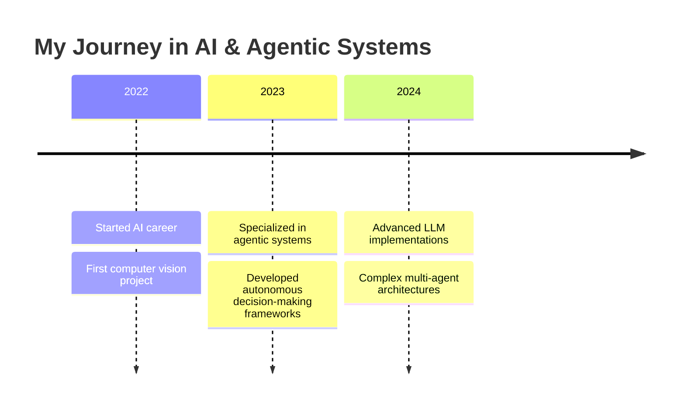

# Fouad Mahmoud

  
[[GitHub followers](https://img.shields.io/github/followers/fouadmahmoud281?style=social)](https://github.com/fouadmahmoud281)
[[Python](https://img.shields.io/badge/-Python-3776AB?style=flat&logo=python&logoColor=white)](https://www.python.org/)
[[AI](https://img.shields.io/badge/-Artificial_Intelligence-FF6F00?style=flat&logo=ai&logoColor=white)](https://github.com/fouadmahmoud281)
[[LLM](https://img.shields.io/badge/-Large_Language_Models-5C3EE8?style=flat&logo=openai&logoColor=white)](https://github.com/fouadmahmoud281)
[[CV](https://img.shields.io/badge/-Computer_Vision-01D277?style=flat&logo=opencv&logoColor=white)](https://github.com/fouadmahmoud281?tab=repositories)

  

## 🤖 About Me

> "Innovative solutions require dumb mistakes" 💡

I'm an **Agentic Systems & AI Engineer** with 1.5+ years of specialized experience in building intelligent systems that autonomously solve complex problems. My expertise spans across LLMs, computer vision, and autonomous decision-making systems. I'm passionate about creating AI that can reason, plan, and execute tasks in the real world.

  

## 🛠️ Tech Stack & Expertise

<table>
  <tr>
    <td valign="top" width="50%">
      <h3>AI & Machine Learning</h3>
      <ul>
        <li>🧠 Large Language Models (LLMs)</li>
        <li>🤖 Agentic Systems Architecture</li>
        <li>👁️ Computer Vision (License Plate Detection)</li>
        <li>📊 Bayesian Models</li>
        <li>🔄 Reinforcement Learning</li>
      </ul>
    </td>
    <td valign="top" width="50%">
      <h3>Technologies & Tools</h3>
      <ul>
        <li>🐍 Python Specialist</li>
        <li>📦 TensorFlow, PyTorch</li>
        <li>🔌 API Development & Integration</li>
        <li>🐳 Docker & Containerization</li>
        <li>☁️ Cloud Services (AWS/GCP)</li>
      </ul>
    </td>
  </tr>
</table>

## 🚀 Featured Projects

  
  

## 📈 My AI Journey

## 🧩 What I Build

- **Autonomous Agents**: Systems that can perceive, decide, and act with minimal human intervention
- **Multi-Agent Networks**: Collaborative AI systems that solve complex tasks through coordination
- **Computer Vision Solutions**: Intelligent systems that can "see" and interpret visual information
- **Decision Support Systems**: AI tools that augment human decision-making with data-driven insights

## 💻 Coding Activity

  

  

## 🔮 Current Explorations

- 🧠 Advancing reasoning capabilities in LLM-based agents
- 🌐 Building autonomous systems that can navigate the web
- 🤝 Creating frameworks for human-AI collaboration
- 📊 Developing better evaluation metrics for agentic systems

## 📫 Let's Connect

  
[[LinkedIn](https://img.shields.io/badge/LinkedIn-0077B5?style=for-the-badge&logo=linkedin&logoColor=white)](https://www.linkedin.com/)
[[Twitter](https://img.shields.io/badge/Twitter-1DA1F2?style=for-the-badge&logo=twitter&logoColor=white)](https://twitter.com/)
[[Portfolio](https://img.shields.io/badge/Portfolio-000000?style=for-the-badge&logo=About.me&logoColor=white)](https://yourportfolio.com)
[[Email](https://img.shields.io/badge/Email-D14836?style=for-the-badge&logo=gmail&logoColor=white)](mailto:your.email@example.com)
  

---

  

  <h3>💡 "The best way to predict the future is to invent it." 💡</h3>

<!-- Add this script at the end of your README to enable interactive elements -->

