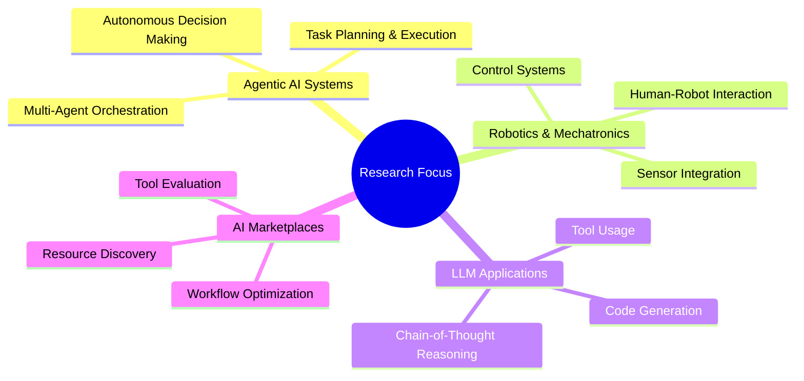

# Fouad Mahmoud

  
[[GitHub followers](https://img.shields.io/github/followers/fouadmahmoud281?style=social)](https://github.com/fouadmahmoud281)
[[Python](https://img.shields.io/badge/-Python-3776AB?style=flat&logo=python&logoColor=white)](https://www.python.org/)
[[LangChain](https://img.shields.io/badge/-LangChain-2a9d8f?style=flat&logoColor=white)](https://langchain.com/)
[[LLM](https://img.shields.io/badge/-LLMs-5C3EE8?style=flat&logo=openai&logoColor=white)](https://github.com/fouadmahmoud281)
[[MLOps](https://img.shields.io/badge/-MLOps-FF6F00?style=flat&logo=kubernetes&logoColor=white)](https://github.com/fouadmahmoud281)

  

## 🤖 About Me

> "Innovative solutions require dumb mistakes" 💡

I'm an **AI & Agentic Systems Engineer** at **Syntera Marketplace**, specializing in building autonomous AI systems that can reason, plan, and act to solve complex problems. I'm also pursuing studies in **Mechatronics & Robotics Engineering**, combining software intelligence with hardware expertise.

Before joining Syntera, I spent 1.5 years as an **AI/Data Science Instructor**, teaching the fundamentals of robotics, AI, and data science.

I architect multi-agent systems using LangChain, LangGraph, and cutting-edge LLMs, combining them with vector databases and robust APIs to create intelligent solutions that can navigate and understand the digital world.

## 🛠️ Technical Arsenal

  <table>
    <tr>
      <td align="center" width="96">
        
         Python
      </td>
      <td align="center" width="96">
        
         REST API
      </td>
      <td align="center" width="96">
        
         Docker
      </td>
      <td align="center" width="96">
        
         Git
      </td>
      <td align="center" width="96">
        
         FastAPI
      </td>
      <td align="center" width="96">
        
         Flask
      </td>
    </tr>
  </table>

### 🧠 AI & Machine Learning Ecosystem

  

<table>
  <tr>
    <td valign="top" width="50%">
      <h3 align="center">AI Frameworks & Tools</h3>
      

        
        
        
        
        
        
        
        
      

    </td>
    <td valign="top" width="50%">
      <h3 align="center">Specializations</h3>
      

        
        
        
        
        
        
        
        
      

    </td>
  </tr>
</table>

## 🚀 Professional Journey

<table>
  <tr>
    <td width="70">
      
    </td>
    <td>
      <h3>AI & Agentic Systems Engineer</h3>
      
<em>Syntera Marketplace | Current</em>

      <ul>
        <li>Lead engineer on Syntera Code Generation & Marketplace products</li>
        <li>Architect multi-agent AI systems using LangChain & LangGraph</li>
        <li>Build autonomous workflows with LLMs for complex tasks</li>
        <li>Develop data pipelines and vector database solutions</li>
      </ul>
    </td>
  </tr>
  <tr>
    <td width="70">
      
    </td>
    <td>
      <h3>AI & Data Science Instructor</h3>
      
<em>1.5 Years</em>

      <ul>
        <li>Taught fundamentals of robotics, AI, and data science</li>
        <li>Designed curriculum and hands-on projects</li>
        <li>Mentored students on real-world AI applications</li>
        <li>Conducted workshops on Python, ML, and AI ethics</li>
      </ul>
    </td>
  </tr>
</table>

## 🏆 Featured Production Projects

<table>
<tr>
<td>

<h3>🚀 Syntera Code Generation</h3>

<strong><code>PRODUCTION APPLICATION</code></strong>

An advanced agentic system that transforms business ideas into production-ready software applications through AI. This autonomous pipeline handles everything from requirements analysis to code generation, testing, and deployment.

<strong>Technologies Used</strong>

 

<code>LangChain</code>
<code>LangGraph</code>
<code>LLMs</code>
<code>Vector Databases</code>
<code>FastAPI</code>
<code>CI/CD</code>

<h4>Key Features</h4>
<ul>
<li>🤖 <strong>Multi-agent reasoning</strong> - Coordinated AI agents that collaborate to solve complex problems</li>
<li>📝 <strong>Spec-to-code generation</strong> - Transforms business requirements into working code</li>
<li>🧪 <strong>Automated testing</strong> - Built-in validation and quality assurance</li>
<li>🔄 <strong>Continuous feedback loops</strong> - Learning from user interactions to improve outputs</li>
</ul>

</td>
</tr>
<tr>
<td>

<h3>🏪 Syntera Marketplace</h3>

<strong><code>PRODUCTION APPLICATION</code></strong>

A centralized hub for AI/ML tools and resources that empowers engineers to create, train, and deploy machine learning applications and models. This comprehensive platform streamlines the entire ML workflow from data preparation to model serving.

<strong>Technologies Used</strong>

 

<code>MLOps</code>
<code>Python</code>
<code>Web Scraping</code>
<code>Streamlit</code>
<code>Vector Search</code>
<code>API Integration</code>

<h4>Key Features</h4>
<ul>
<li>🔍 <strong>AI tool discovery</strong> - Intelligent search and recommendations for AI/ML tools</li>
<li>📊 <strong>Resource management</strong> - Centralized control of AI/ML assets</li>
<li>⚙️ <strong>Model deployment</strong> - Streamlined deployment pipelines for ML models</li>
<li>📈 <strong>Analytics dashboard</strong> - Comprehensive usage and performance metrics</li>
</ul>

</td>
</tr>
</table>

## 🔮 What I Build

  <table>
    <tr>
      <td align="center">
        
        <h3>Autonomous Agent Systems</h3>
        
Multi-agent architectures that can perceive, reason, plan, and act to solve complex tasks with minimal human intervention.

        

        
<code>LangChain</code> <code>LangGraph</code> <code>LLMs</code>

      </td>
      <td align="center">
        
        <h3>LLM-powered Applications</h3>
        
Fine-tuned and optimized LLM implementations for specific domains, with sophisticated prompting strategies.

        

        
<code>LangSmith</code> <code>Vector DBs</code> <code>Fine-tuning</code>

      </td>
    </tr>
    <tr>
      <td align="center">
        
        <h3>Robotics & Mechatronics</h3>
        
Intelligent systems that bridge the gap between software and hardware, combining AI with physical world interaction.

        

        
<code>Control Systems</code> <code>Sensors</code> <code>Actuators</code>

      </td>
      <td align="center">
        
        <h3>AI Data Pipelines</h3>
        
End-to-end data workflows that ingest, process, and transform data for AI/ML applications.

        

        
<code>MLOps</code> <code>Data Engineering</code> <code>Python</code>

      </td>
    </tr>
  </table>

## 📈 GitHub Activity

  

  

## 🔍 Research Interests & Current Focus

## 👨‍🔬 Learning Journey & Education

  

    
🎓

    

      <h3>Mechatronics & Robotics Engineering</h3>
      
Studying the intersection of mechanical engineering, electronics, and software to build intelligent physical systems

    

  

  
  

    
🧪

    

      <h3>Continuous Learning</h3>
      
Constantly exploring advancements in AI, LLMs, and agent systems through research papers, courses, and hands-on projects

    

  

## 📫 Let's Connect

  
[[LinkedIn](https://img.shields.io/badge/LinkedIn-0077B5?style=for-the-badge&logo=linkedin&logoColor=white)](https://www.linkedin.com/)
[[Twitter](https://img.shields.io/badge/Twitter-1DA1F2?style=for-the-badge&logo=twitter&logoColor=white)](https://twitter.com/)
[[Portfolio](https://img.shields.io/badge/Portfolio-000000?style=for-the-badge&logo=About.me&logoColor=white)](https://yourportfolio.com)
[[Email](https://img.shields.io/badge/Email-D14836?style=for-the-badge&logo=gmail&logoColor=white)](mailto:your.email@example.com)
  

---

  

  <h3>💡 "Building intelligent systems that bridge the digital and physical worlds." 💡</h3>

