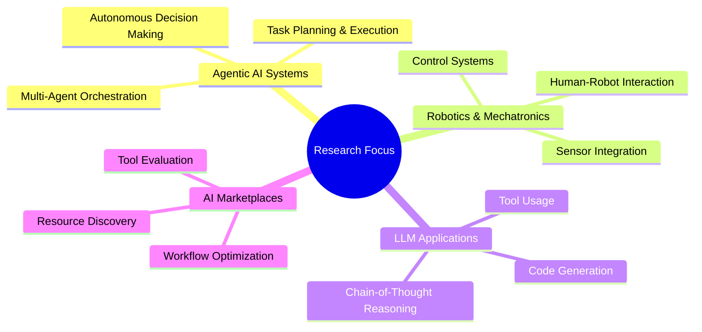

# Fouad Mahmoud

  
[[GitHub followers](https://img.shields.io/github/followers/fouadmahmoud281?style=social)](https://github.com/fouadmahmoud281)
[[Python](https://img.shields.io/badge/-Python-3776AB?style=flat&logo=python&logoColor=white)](https://www.python.org/)
[[LangChain](https://img.shields.io/badge/-LangChain-2a9d8f?style=flat&logoColor=white)](https://langchain.com/)
[[LLM](https://img.shields.io/badge/-LLMs-5C3EE8?style=flat&logo=openai&logoColor=white)](https://github.com/fouadmahmoud281)
[[MLOps](https://img.shields.io/badge/-MLOps-FF6F00?style=flat&logo=kubernetes&logoColor=white)](https://github.com/fouadmahmoud281)

  

## 🤖 About Me

> "Innovative solutions require dumb mistakes" 💡

I'm an **AI & Agentic Systems Engineer** at **Syntera Marketplace**, specializing in building autonomous AI systems that can reason, plan, and act to solve complex problems. I'm also pursuing studies in **Mechatronics & Robotics Engineering**, combining software intelligence with hardware expertise.

Before joining Syntera, I spent 1.5 years as an **AI/Data Science Instructor**, teaching the fundamentals of robotics, AI, and data science.

I architect multi-agent systems using LangChain, LangGraph, and cutting-edge LLMs, combining them with vector databases and robust APIs to create intelligent solutions that can navigate and understand the digital world.

## 🛠️ Technical Arsenal

  <table>
    <tr>
      <td align="center" width="96">
        
         Python
      </td>
      <td align="center" width="96">
        
         REST API
      </td>
      <td align="center" width="96">
        
         Docker
      </td>
      <td align="center" width="96">
        
         Git
      </td>
      <td align="center" width="96">
        
         FastAPI
      </td>
      <td align="center" width="96">
        
         Flask
      </td>
    </tr>
  </table>

### 🧠 AI & Machine Learning Ecosystem

  

<table>
  <tr>
    <td valign="top" width="50%">
      <h3 align="center">AI Frameworks & Tools</h3>
      

        
        
        
        
        
        
        
        
      

    </td>
    <td valign="top" width="50%">
      <h3 align="center">Specializations</h3>
      

        
        
        
        
        
        
        
        
      

    </td>
  </tr>
</table>

## 🚀 Professional Journey

  

    

      

      

        <h3>AI & Agentic Systems Engineer</h3>
        <h4>Syntera Marketplace | Current</h4>
        <ul>
          <li>Lead engineer on Syntera Code Generation & Marketplace products</li>
          <li>Architect multi-agent AI systems using LangChain & LangGraph</li>
          <li>Build autonomous workflows with LLMs for complex tasks</li>
          <li>Develop data pipelines and vector database solutions</li>
        </ul>
      

    

    

      

      

        <h3>AI & Data Science Instructor</h3>
        <h4>1.5 Years</h4>
        <ul>
          <li>Taught fundamentals of robotics, AI, and data science</li>
          <li>Designed curriculum and hands-on projects</li>
          <li>Mentored students on real-world AI applications</li>
          <li>Conducted workshops on Python, ML, and AI ethics</li>
        </ul>
      

    

  

## 🏆 Featured Production Projects

<h3 style="font-size: 24px; margin: 0; color: #f0f9ff;">🚀 Syntera Code Generation</h3>

Production Application

css

Copy

An advanced agentic system that transforms business ideas into production-ready software applications through AI. This autonomous pipeline handles everything from requirements analysis to code generation, testing, and deployment.

  LangChain
  LangGraph
  LLMs
  Vector Databases
  FastAPI
  CI/CD

  <h4 style="color: #94a3b8; font-size: 16px; margin-top: 0; margin-bottom: 15px; letter-spacing: 1px; text-transform: uppercase;">Key Highlights</h4>
  

    

      🤖
      Multi-agent reasoning
    

    

      📝
      Spec-to-code generation
    

    

      🧪
      Automated testing
    

    

      🔄
      Continuous feedback loops
    

  

<h3 style="font-size: 24px; margin: 0; color: #f0f9ff;">🏪 Syntera Marketplace</h3>

Production Application

css

Copy

A centralized hub for AI/ML tools and resources that empowers engineers to create, train, and deploy machine learning applications and models. This comprehensive platform streamlines the entire ML workflow from data preparation to model serving.

  MLOps
  Python
  Web Scraping
  Streamlit
  Vector Search
  API Integration

  <h4 style="color: #94a3b8; font-size: 16px; margin-top: 0; margin-bottom: 15px; letter-spacing: 1px; text-transform: uppercase;">Key Highlights</h4>
  

    

      🔍
      AI tool discovery
    

    

      📊
      Resource management
    

    

      ⚙️
      Model deployment
    

    

      📈
      Analytics dashboard
    

  

🔮 What I Build

🤖

<h3 style="font-size: 20px; margin: 10px 0; color: #f8fafc;">Autonomous Agent Systems</h3>

Multi-agent architectures that can perceive, reason, plan, and act to solve complex tasks with minimal human intervention.

LangChain, LangGraph, LLMs

🧠

<h3 style="font-size: 20px; margin: 10px 0; color: #f8fafc;">LLM-powered Applications</h3>

Fine-tuned and optimized LLM implementations for specific domains, with sophisticated prompting strategies.

LangSmith, Vector DBs, Fine-tuning

🦾

<h3 style="font-size: 20px; margin: 10px 0; color: #f8fafc;">Robotics & Mechatronics</h3>

Intelligent systems that bridge the gap between software and hardware, combining AI with physical world interaction.

Control Systems, Sensors, Actuators

📊

<h3 style="font-size: 20px; margin: 10px 0; color: #f8fafc;">AI Data Pipelines</h3>

End-to-end data workflows that ingest, process, and transform data for AI/ML applications.

MLOps, Data Engineering, Python

## 📈 GitHub Activity

  

  

## 🔍 Research Interests & Current Focus

## 👨‍🔬 Learning Journey & Education

  

    
🎓

    

      <h3>Mechatronics & Robotics Engineering</h3>
      
Studying the intersection of mechanical engineering, electronics, and software to build intelligent physical systems

    

  

  
  

    
🧪

    

      <h3>Continuous Learning</h3>
      
Constantly exploring advancements in AI, LLMs, and agent systems through research papers, courses, and hands-on projects

    

  

## 📫 Let's Connect

  
[[LinkedIn](https://img.shields.io/badge/LinkedIn-0077B5?style=for-the-badge&logo=linkedin&logoColor=white)](https://www.linkedin.com/)
[[Twitter](https://img.shields.io/badge/Twitter-1DA1F2?style=for-the-badge&logo=twitter&logoColor=white)](https://twitter.com/)
[[Portfolio](https://img.shields.io/badge/Portfolio-000000?style=for-the-badge&logo=About.me&logoColor=white)](https://yourportfolio.com)
[[Email](https://img.shields.io/badge/Email-D14836?style=for-the-badge&logo=gmail&logoColor=white)](mailto:your.email@example.com)
  

---

  

  <h3>💡 "Building intelligent systems that bridge the digital and physical worlds." 💡</h3>

